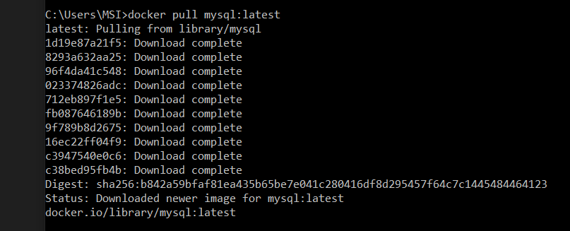
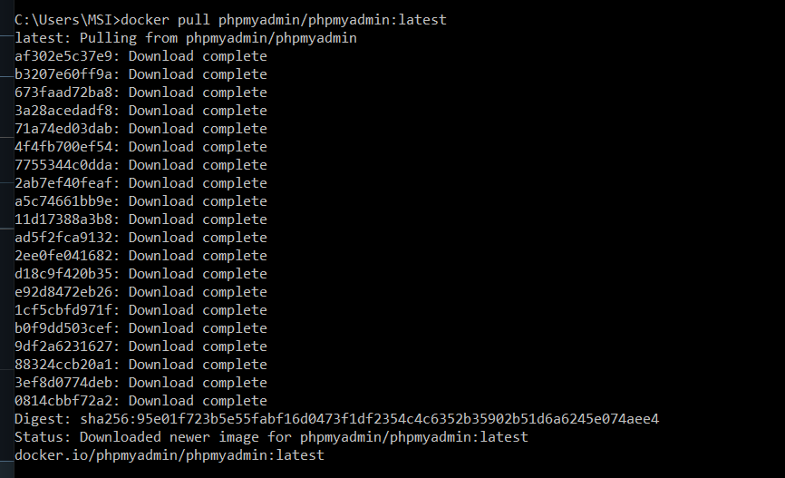
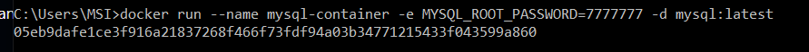
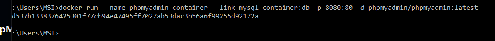
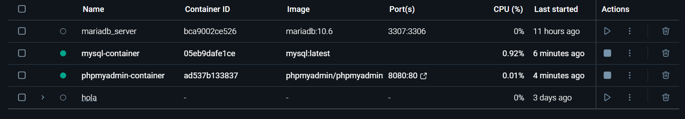
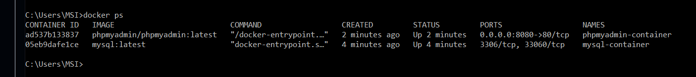
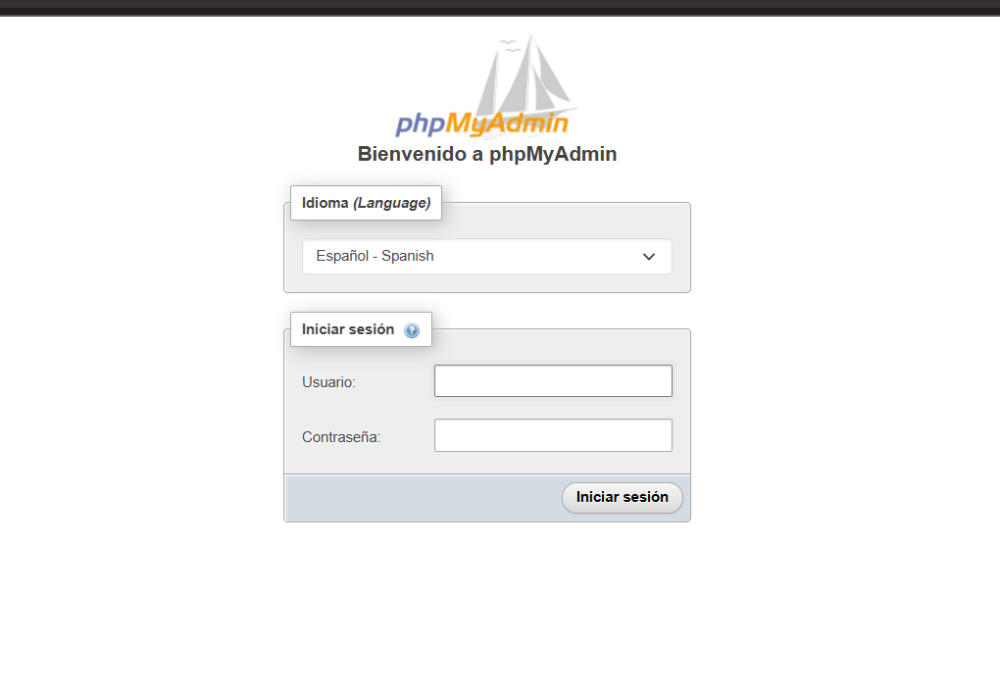
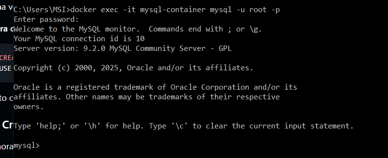
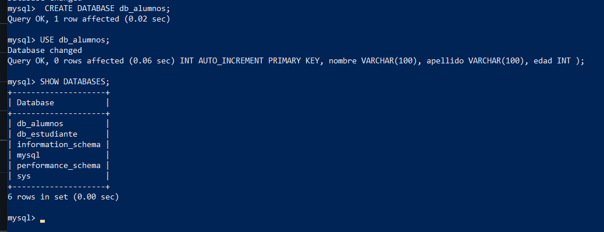

# trabajo mysql "conexión x (Gabriel, dante Joseph)"

## 1️⃣ Verificar que Docker esté instalado y funcionando

## instalador de mysql

## instalador de php

## contenedor de mysql

## contenedor de php( INSTALAMOS EL CONTENEDOR )

## verificamos en el docker desktop que se crearon los contenedores

## y tambien verificamos con docker ps

## y con localhost

## entramos al contenedor con la contraseña que establecimos anteriormente 

## creamos la tabla y verificamos los datos al final 

## salimos de la tabla con el comando EXIT; 

## como recomendacion agregar un comando para elimar contenido de las tablas y modificar 